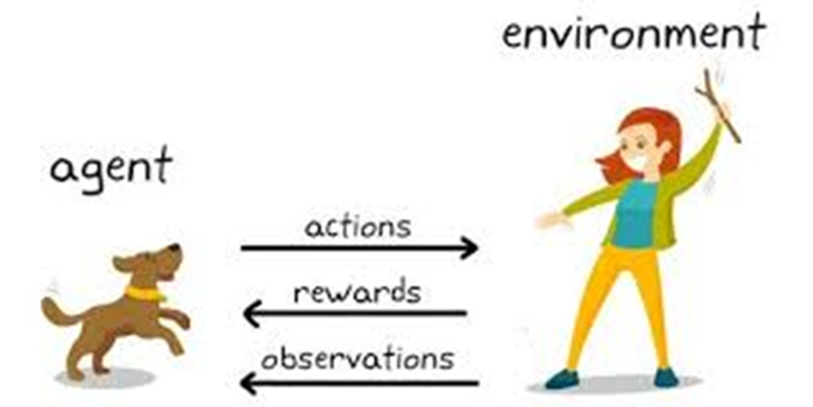
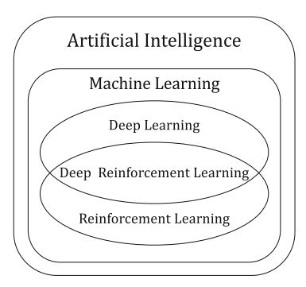
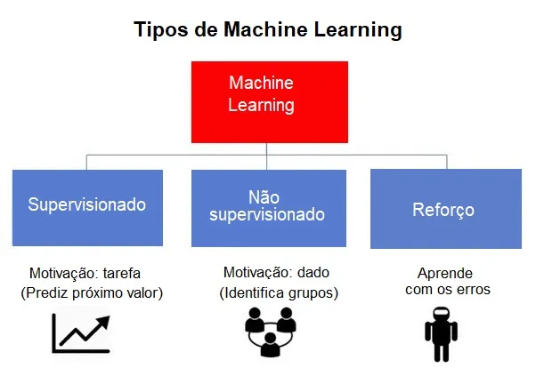
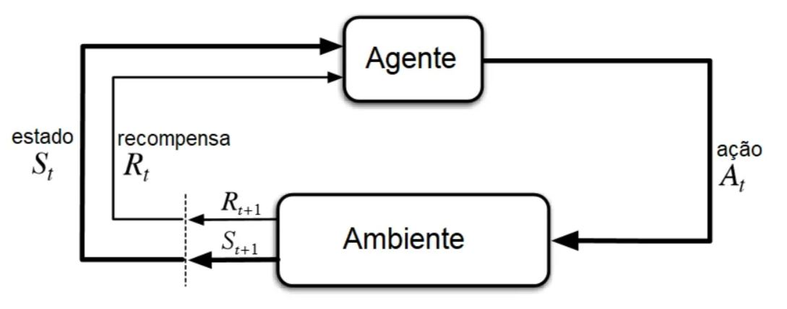
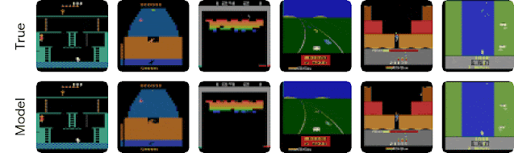
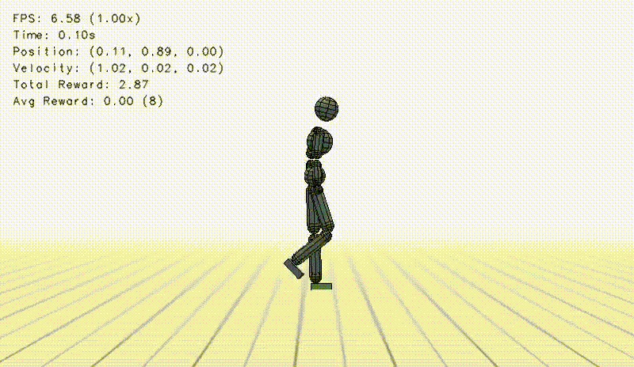
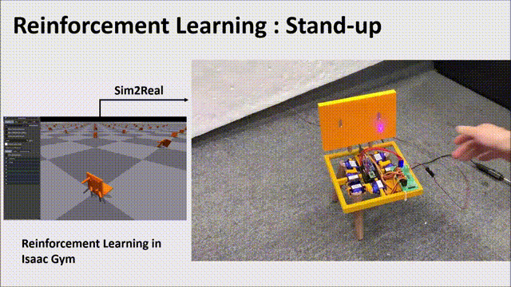
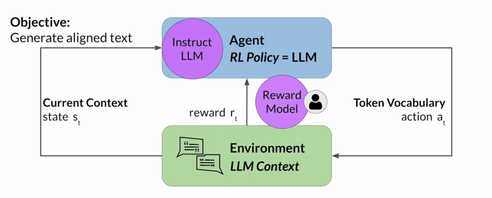

# Reinforcement Learning

## Agenda 

- [Reinforcement Learning](#reinforcement-learning)
  - [Agenda](#agenda)
  - [1. Introdução ↺](#1-introdução-)
  - [2. Conceitos Fundamentais ↺](#2-conceitos-fundamentais-)
  - [3. Aplicações Práticas ↺](#3-aplicações-práticas-)
  - [4. Exemplo ↺](#4-exemplo-)
  - [5. Referências ↺](#5-referências-)

--------

## 1. Introdução [&#x21ba;](#agenda)

**Aprendizado por Reforço (Reinforcement Learning – RL)** é um ramo do aprendizado de máquina em que um agente aprende a tomar decisões interagindo com um ambiente. O objetivo do agente é aprender uma política que maximize a recompensa cumulativa ao longo do tempo.

O Aprendizado por Reforço é uma subárea do aprendizado de máquina (Machine Learning – ML) que permite que os computadores aprendam por meio da interação com o ambiente. Em resumo, o RL divide o mundo real em dois componentes principais: o ambiente e o agente. O agente interage com o ambiente ao executar determinadas ações e recebe um retorno desse ambiente. Esse retorno é geralmente chamado de "recompensa" no contexto do RL. O agente aprende a melhorar seu desempenho buscando maximizar as recompensas positivas recebidas do ambiente. Esse processo de aprendizado estabelece um ciclo de feedback entre o ambiente e o agente, orientando sua melhoria contínua por meio de algoritmos de RL.

Conforme ilustrado, a relação entre Inteligência Artificial (AI), Aprendizado de Máquina (ML), Aprendizado Profundo (DL), Aprendizado por Reforço (RL) e Aprendizado por Reforço Profundo (DRL) pode ser entendida como uma hierarquia de conceitos dentro da IA.

1. **Inteligência Artificial (AI – Artificial Intelligence)**
É o campo da ciência da computação que busca criar sistemas capazes de realizar tarefas que normalmente exigiriam inteligência humana, como reconhecimento de padrões, tomada de decisão e aprendizado.

2. **Aprendizado de Máquina (ML – Machine Learning)**
É um subconjunto da IA que se concentra em algoritmos que permitem que os computadores aprendam a partir de dados, sem serem explicitamente programados. O ML pode ser dividido em três categorias principais:

- *Aprendizado Supervisionado*: O modelo aprende a partir de dados rotulados.

- *Aprendizado Não Supervisionado*: O modelo encontra padrões em dados não rotulados.

- *Aprendizado por Reforço (RL)*: O modelo aprende com base em interações e recompensas do ambiente.

3. **Aprendizado Profundo (DL – Deep Learning)**
É uma subárea do ML que utiliza redes neurais profundas para aprender representações complexas dos dados. O DL é amplamente utilizado em tarefas como visão computacional, processamento de linguagem natural e jogos.

4. **Aprendizado por Reforço (RL – Reinforcement Learning)**
É um tipo de aprendizado de máquina em que um agente aprende a tomar decisões interagindo com um ambiente e recebendo recompensas ou penalidades. O objetivo do agente é aprender uma política ótima para maximizar a recompensa cumulativa ao longo do tempo.

5. **Aprendizado por Reforço Profundo (DRL – Deep Reinforcement Learning)**
É a interseção entre Aprendizado Profundo e Aprendizado por Reforço. No DRL, redes neurais profundas são usadas para aproximar funções complexas, permitindo que o agente tome decisões em espaços de estados de alta dimensão. O DRL foi responsável por avanços notáveis, como o AlphaGo e sistemas de controle autônomo.

Embora o aprendizado profundo **(Deep Learning – DL)** possua uma poderosa capacidade de representação de dados, isso não é suficiente para construir um sistema de inteligência artificial verdadeiramente inteligente. Isso ocorre porque um sistema de IA não deve apenas aprender a partir dos dados fornecidos, mas também ser capaz de aprender por meio da interação com o ambiente do mundo real, assim como um ser humano.

## 2. Conceitos Fundamentais [&#x21ba;](#agenda)

RL é basicamente um processo de aprendizado de tentativa e erro. Como exemplo, no jogo de xadrez, o agente (programa de software) é o jogador de xadrez. Então, o agente interage com o ambiente (tabuleiro de xadrez) executando uma ação (movimentos). Se o agente obtiver uma recompensa positiva por uma ação, então ele preferirá executar essa ação; caso contrário, ele encontrará uma ação diferente que dê uma recompensa positiva.

As etapas envolvidas em um algoritmo RL típico são as seguintes:

1. Primeiro, o agente interage com o ambiente executando uma ação.
2. Ao executar uma ação, o agente se move de um estado para outro.
3. Então o agente receberá uma recompensa com base na ação que ele executou.
4. Com base na recompensa, o agente entenderá se a ação é boa ou ruim.
5. Se a ação foi boa, ou seja, se o agente recebeu uma recompensa positiva, então o agente preferirá executar essa ação, caso contrário o agente tentará executar outras ações em busca de uma recompensa positiva.

## 3. Aplicações Práticas [&#x21ba;](#agenda)

- ### **Jogos:** AlphaGo, AlphaZero, Deep Q-Networks para Atari. 

- ### **Robótica:** Locomoção, manipulação robótica, navegação.

- ### **Sistemas Autônomos:** Veículos autônomos, drones, sistemas de controle.

- ### **Processamento de Linguagem Natural:** Sistemas de diálogo, tradução automática.

- ### **Outros Usos:**

  - #### **Otimização de Recursos:** Alocação de recursos, planejamento e agendamento.

  - #### **Saúde:** Planejamento de tratamentos, diagnósticos otimizados.

  - #### **Finanças:** Negociação algorítmica, gestão de portfólio.

## 4. Exemplo [&#x21ba;](#agenda)

https://user-images.githubusercontent.com/37583039/219359191-7988e0dc-b1a4-43cc-82d1-4cc18be0d0a2.mp4

## 5. Referências [&#x21ba;](#agenda)

1. Reinforcement Learning: An Introduction. Richard S. Sutton, Andrew G. Barto. http://incompleteideas.net/book/the-book.html.
2. Mnih, V., Kavukcuoglu, K., Silver, D., Graves, A., Antonoglou, I., Wierstra, D. and Riedmiller, M., 2013. Playing atari with deep reinforcement learning. arXiv preprint arXiv:1312.5602.
3. Berseth, G., Golemo, F. and Pal, C., Visual Imitation with Reinforcement Learning using Recurrent Siamese Networks.
4. Guo, D., Yang, D., Zhang, H., Song, J., Zhang, R., Xu, R., Zhu, Q., Ma, S., Wang, P., Bi, X. and Zhang, X., 2025. Deepseek-r1: Incentivizing reasoning capability in llms via reinforcement learning. arXiv preprint arXiv:2501.12948.
5. Código-Fonte do experimento de Lunar-Lender https://github.com/juliankappler/lunar-lander
6. https://gymnasium.farama.org/
7. https://ale.farama.org/environments/complete_list/
  
